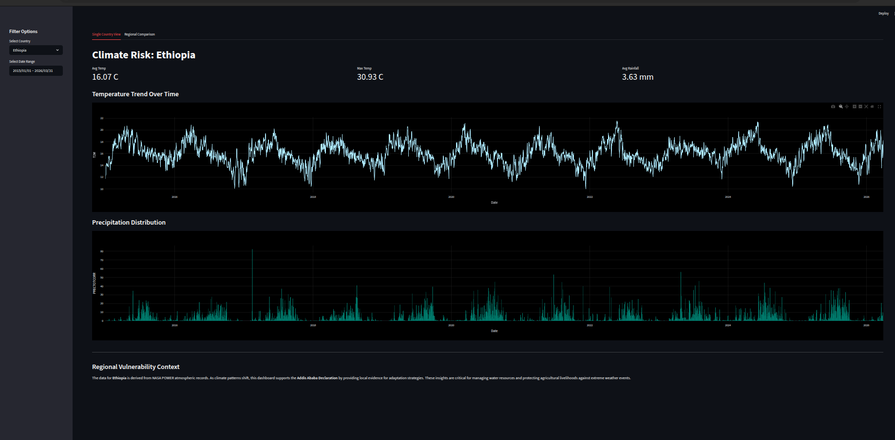
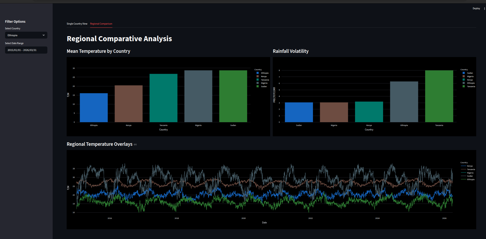
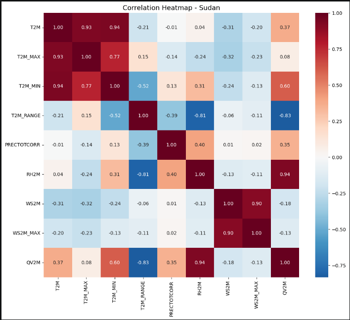
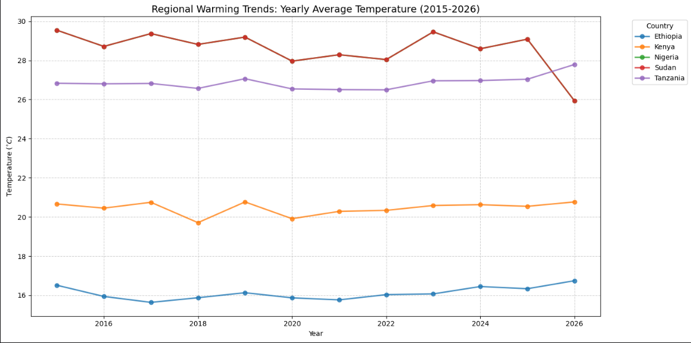

# climate_challange_W0

# 🌍 Climate Change Analysis Dashboard (Week 0 Challenge)

A comprehensive data science project that transforms raw NASA POWER atmospheric data into an interactive monitoring tool. This project analyzes climate risk across **Ethiopia, Sudan, Kenya, Nigeria, and Tanzania**.

---

## 📸 Final Dashboard Overview

#### 1. Single Country View


#### 2. Comparative Analysis


               *Figure 1: The "Single Country View" featuring the high-contrast Blue-White theme.*
               *Figure 2: The "regional comparison view" featuring the high-contrast Blue-White theme.*


---

## 🛠️ Project Evolution (Task-Based Development)
This repository followed a structured development lifecycle, preserved in individual task branches:

### **Task 1: EDA & Data Cleaning Pipeline**

                - Branch: `task-1-eda`

                - Scope: In-depth Exploratory Data Analysis for 5 countries.

                - Process: Cleaned raw meteorological data, handled missing values, and standardized date formats.

                - Output: Individual country CSVs in `data/cleaned_data/`.

### 🔍 Exploratory Data Analysis (EDA)


### **Task 2: Regional Comparison & Data Merging**
                - Branch: `task-2-merging`

                - Scope: Statistical merging of datasets.

                - process: Performed cross-country comparisons of temperature and rainfall volatility using a master pivot-table approach.
                
                - Output: `data/master_climate_data.csv`.


### **Task 3: Interactive Dashboard Development**
                - Branch: `task-3-dashboard`

                - Scope: Frontend engineering with Streamlit.

                - Process: Implemented a full-black "Control Room" UI with Plotly visualizations.

#### 🗺️ Regional Trends

---

### 📋 Data Insights & Findings

## 1. Temperature Profiles & Warming Trends

    ## Regional Thermal Extremes: 
             Sudan consistently records the highest mean temperatures in the study area, peaking near 30°C, while Ethiopia remains the coolest with an average of 16.07°C due to its unique high-altitude topography.

    ## Localized Warming: 
             While most countries show steady fluctuations, Tanzania displays a notable upward trend in yearly average temperature leading into 2026, suggesting a regional warming acceleration.

    ## Seasonal Variance:
              Ethiopia faces a high-contrast risk profile; despite a low average temperature, it experiences maximum peaks of 30.93°C, indicating a wide thermal range that can impact agricultural stability.

## 2. Precipitation & Volatility
    ## Rainfall Volatility: 
             Tanzania exhibits the highest precipitation volatility among the five countries. This unpredictable rainfall pattern presents a higher risk for water resource management compared to the more stable (though drier) climate of Sudan.

    ## Predictability: 
             Nigeria and Sudan show lower volatility, suggesting that while they may face different climate challenges, their precipitation cycles are historically more predictable than those in the East African rift zone.

## 3. Regional Summary
             The Regional Temperature Overlays show that all five countries follow a synchronized seasonal pulse, yet the absolute temperature gap between the hottest (Sudan) and coolest (Ethiopia) remains a consistent 10-12°C margin.


## 📂 Repository Structure
                 ```text
                        climate-challenge-week0/
                        ├── app/
                        |   └── main.py                 # Final Streamlit Application
                        ├── data/
                        │   ├── raw_data/               # Task 1: Original NASA POWER files
                        │   ├── cleaned_data/           # Task 1: Processed CSVs
                        │   └── master_climate_data.csv # Task 2: Final Merged Dataset
                        ├── images/
                        │   └── dashboard_dark_mode.png # README visual assets
                        ├── notebooks/
                        │   ├── ethiopia_eda.ipynb      # EDA Notebooks
                        │   ├── ...                     # (Kenya, Nigeria, Sudan, Tanzania)
                        │   └── comparison_analysis.ipynb # Task 2: Comparative Logic
                        ├── .gitignore                  # Exclusion of venv/ and cache files
                        └── requirements.txt            # Project Dependencies


##How to Run Locally:


              Clone:

              Bash
              git clone [https://github.com/your-username/your-repo.git](https://github.com/your-username/your-repo.git)

              cd climate-challenge-week0


              Environment Setup:

                Bash
                python3 -m venv venv
                source venv/bin/activate
                pip install -r requirements.txt
                
              Run:

                Bash
                 streamlit run app/main.py


##🧑‍🔬 Author:

         Sinen Dirirsa // Computer science major at AAU
         
         10 Academy week-0 challenge


